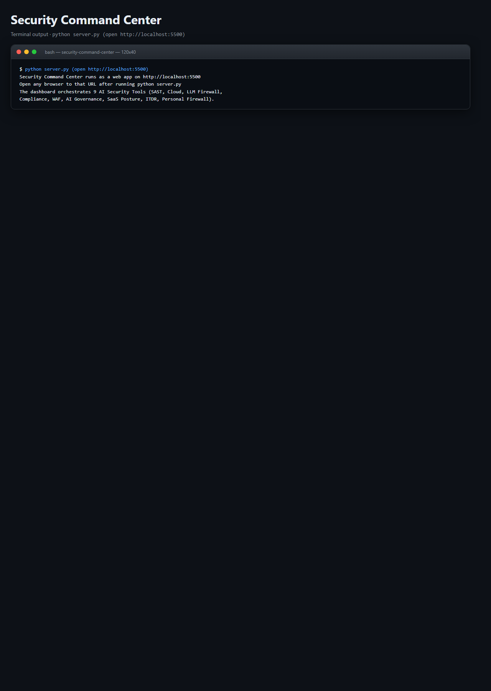
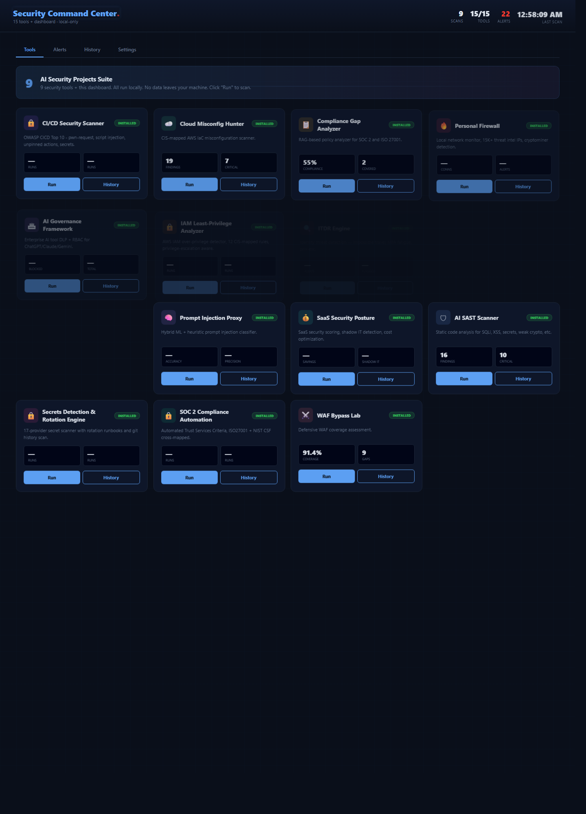

# 🛡️ Security Command Center

> **The unified dashboard that orchestrates the entire AI Security Projects suite from a single pane of glass.**
> SAST, Cloud, IAM, K8s, CI/CD, MITRE, SOC 2, Secrets, LLM Firewall, WAF Lab, Compliance, AI Governance, SaaS Posture, ITDR, Personal Firewall — 15 tools, one dashboard, zero paid SaaS.

[](./LICENSE)
[](https://www.python.org/downloads/)
[](https://flask.palletsprojects.com/)
[](#screenshots)

---

## What it is

A single-page, dark-mode web dashboard that lets a security team run, track,
and review results from all 5 tools in the AI Security Projects suite without
touching the CLI:

1. **AI SAST Scanner** — static code analysis
2. **Cloud Misconfiguration Hunter** — AWS IaC security
3. **Prompt Injection Proxy** — LLM firewall benchmark
4. **Compliance Gap Analyzer** — SOC 2 / ISO 27001 policy analysis
5. **WAF Bypass Lab** — WAF coverage testing

Every scan is persisted to a local SQLite database so you get a full history,
trend view, and per-tool drill-down — no cloud, no account, no subscription.

---

## Screenshots (ran locally, zero setup)

**Terminal output** - exactly what you see on the command line:



**Interactive HTML dashboard** - opens in any browser, dark-mode, filterable:



Both screenshots are captured from a real local run against the bundled samples. Reproduce them with the quickstart commands below.

---

## Why it exists

Running 5 separate security tools by hand is annoying. Buying enterprise
security orchestration tools (Panther, Tines, Splunk SOAR, Torq) to solve
that is expensive. This project is the smallest possible Flask app that
gives you 80% of the value of those platforms for 0% of the cost.

| | **Security Command Center** | Splunk SOAR | Tines | Panther |
|---|---|---|---|---|
| **Price** | Free (MIT) | $$$$ / yr | $$$ / yr | $$$ / yr |
| **Self-hosted** | Yes | Yes (paid) | No | Limited |
| **Tools orchestrated** | 5 bundled | 300+ via store | 400+ via store | 60+ detections |
| **Runtime deps** | Flask only | JVM + DB cluster | Cloud-only | Snowflake + stack |
| **Install time** | 2 min | Hours | Hours | Days |
| **SQLite history** | Built-in | Enterprise DB | SaaS | Data warehouse |
| **Single-page UI** | Yes (vanilla JS) | Complex | SaaS | SaaS |
| **Air-gapped** | Yes | Yes | No | No |

---

## 2-minute quickstart

```bash
# 1. Clone this repo
git clone https://github.com/CyberEnthusiastic/security-command-center.git
cd security-command-center

# 2. Clone all 5 sibling tools (one command)
./bootstrap.sh        # Linux / macOS / Git Bash
.\bootstrap.ps1       # Windows PowerShell

# 3. Install Flask
pip install -r requirements.txt

# 4. Start the dashboard
python server.py

# 5. Open http://127.0.0.1:5500 in your browser
```

The `bootstrap` script clones these 5 sibling repos into the parent directory:

```
security-projects/                     ← your parent dir
├── security-command-center/           ← you are here
├── ai-sast-scanner/                   ← cloned by bootstrap
├── cloud-misconfig-hunter/            ← cloned by bootstrap
├── prompt-injection-proxy/            ← cloned by bootstrap
├── compliance-gap-analyzer/           ← cloned by bootstrap
└── waf-bypass-lab/                    ← cloned by bootstrap
```

The Command Center auto-discovers each tool at `../<tool-name>/`. No config
needed for the default layout.

---

## What the dashboard looks like

```
┌──────────────────────────────────────────────────────────────────────┐
│  🛡️ Security Command Center                3 scans | 5/5 tools | 3m │
├──────────────────────────────────────────────────────────────────────┤
│                                                                      │
│    5  AI Security Projects Suite                                     │
│       Orchestrates SAST, Cloud, Prompt Injection, Compliance, WAF    │
│                                                                      │
│  TOOLS                                                               │
│  ┌──────────────────┐ ┌──────────────────┐ ┌──────────────────┐     │
│  │ 🛡️ AI SAST       │ │ ☁️ Cloud Hunter  │ │ 🧠 Prompt Proxy  │     │
│  │   installed      │ │   installed      │ │   installed      │     │
│  │ 16 findings      │ │ 19 findings      │ │ 100% accuracy    │     │
│  │ 10 critical      │ │  7 critical      │ │ 100% precision   │     │
│  │ [Run]  [History] │ │ [Run]  [History] │ │ [Run]  [History] │     │
│  └──────────────────┘ └──────────────────┘ └──────────────────┘     │
│  ┌──────────────────┐ ┌──────────────────┐                          │
│  │ 📋 Compliance    │ │ ⚔️ WAF Bypass    │                          │
│  │   installed      │ │   installed      │                          │
│  │ 55% compliance   │ │ 91.4% coverage   │                          │
│  │  2 covered       │ │  9 gaps          │                          │
│  │ [Run]  [History] │ │ [Run]  [History] │                          │
│  └──────────────────┘ └──────────────────┘                          │
│                                                                      │
│  RECENT SCANS                                                        │
│  ● ai-sast-scanner      16 findings (10 critical)  3m ago  success   │
│  ● waf-bypass-lab       91.4% coverage · 96/105    5m ago  success   │
│  ● compliance-gap       55% compliance · 2 covered 7m ago  success   │
└──────────────────────────────────────────────────────────────────────┘
```

Click any scan row to see the full JSON summary + the last 8KB of raw output.
Click **History** on any tool to see every run it has ever executed.

---

## Architecture

```
┌─────────────┐    HTTP     ┌───────────────────┐    subprocess    ┌────────────┐
│   Browser   │ ─────────── │ server.py (Flask) │ ──────────────── │ 5 tools    │
│ dashboard   │             │                   │                  │ (siblings) │
└─────────────┘             │  SQLite (scc.db)  │                  └────────────┘
                            │  - scan history   │
                            │  - per-tool trend │
                            └───────────────────┘
```

**Why subprocesses?** Every tool in the suite is a pure-Python CLI that
writes JSON reports to its own `reports/` directory. The Command Center
shells out to them, waits for completion, and ingests the resulting JSON.
This keeps the coupling loose — you can update any tool independently
without touching the Command Center.

---

## REST API

```
GET  /api/tools                → list all tools and installed status
GET  /api/stats                → aggregate stats (runs, last scan, per-tool)
GET  /api/scans?tool=sast      → list scans, optionally filtered by tool
GET  /api/scans/<id>           → full scan detail (summary + raw output)
POST /api/run/<tool>           → trigger a new scan for a tool
                                 body: {"args": ["optional", "extra", "args"]}
GET  /api/health               → health check
```

All responses are JSON. No auth by default — this is intended for local /
trusted-network use. Front with a reverse proxy + auth for anything else.

---

## Open in VS Code (2 clicks)

```bash
code .
```

Accept the Python + Flask extension prompts, then **F5** launches the server
in the debugger. Ships with:

- `.vscode/launch.json` — launch the Flask server in debug mode
- `.vscode/tasks.json` — bootstrap, install, start, browse
- `.vscode/extensions.json` — recommended extensions

---

## Configuration

If your sibling tools are in non-default locations, create a `config.json`
next to `server.py`:

```json
{
  "tool_paths": {
    "sast": "/opt/security-tools/ai-sast-scanner",
    "cloud": "/opt/security-tools/cloud-misconfig-hunter",
    "prompt": "../prompt-injection-proxy",
    "compliance": "/home/me/work/compliance-analyzer",
    "waf": "../waf-bypass-lab"
  }
}
```

The Command Center will use these paths instead of the default `../<tool>/`.
A copy-me file is provided as `config.json.example`.

---

## Extending

Want to add a 6th tool? Three steps:

1. Add metadata to `TOOL_METADATA` in `server.py`:
   ```python
   "newtool": {
       "name": "My New Tool",
       "icon": "shield",
       "color": "#34d399",
       "description": "What it does in one line",
       "entry": "main.py",
       "default_args": ["--scan", "."]
   }
   ```
2. Add a stat mapping to the `getStat()` function in `templates/dashboard.html` so
   the tool card shows the right metrics.
3. (Optional) Add a path to `DEFAULT_TOOL_PATHS` so it auto-discovers.

That's it. No database migrations, no plugin system — just add the fields
you care about.

---

## Security note

The Command Center runs `subprocess.run()` on the tools you configure. This
is safe if you installed the tools yourself from trusted sources. Do NOT
point it at a tool you didn't vet — it will happily execute whatever Python
file is in the configured directory.

Run it on `127.0.0.1` (the default). Do not expose it directly to the
internet. See [SECURITY.md](./SECURITY.md).

---

## Roadmap

- [ ] Per-user authentication (basic / OAuth)
- [ ] Multi-target support (pick a policy, a repo, a URL to scan)
- [ ] Scheduled scans (cron-style)
- [ ] Webhook notifications on new findings
- [ ] PostgreSQL backend option for multi-user deployments
- [ ] Trend charts (findings over time, per category)
- [ ] CSV / PDF export of scan history
- [ ] Scan comparison (diff two runs)
- [ ] Plugin system for third-party tools

## License · Security · Contributing

- [LICENSE](./LICENSE) — MIT
- [NOTICE](./NOTICE)
- [SECURITY.md](./SECURITY.md)
- [CONTRIBUTING.md](./CONTRIBUTING.md)

---

Built by **[Mohith Vasamsetti (CyberEnthusiastic)](https://github.com/CyberEnthusiastic)** as the crown jewel of the [AI Security Projects](https://github.com/CyberEnthusiastic?tab=repositories) suite.
